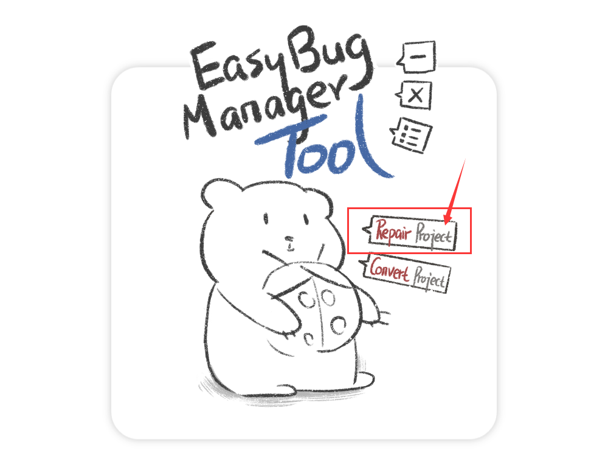
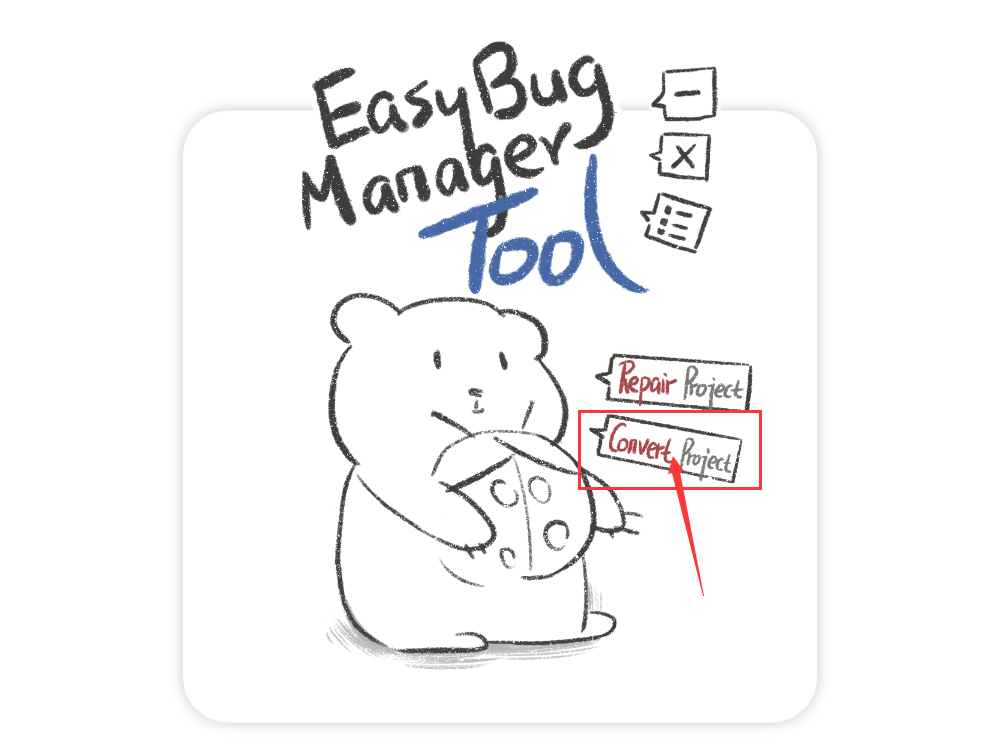

# Easy Bug Manager Tool

 

## 说明

这个软件是Easy Bug Manager软件的小工具合集。

目前有2个功能：

- 修复项目
- 转换项目

 

 

 

## 下载

最新版本： v0.1.0.0 (2020年02月29日)

下载地址：[点击下载v0.1.0.0版本](https://github.com/xujiangjiang/Easy-Bug-Manager-Tool/releases/download/v0.1.0.0/Easy.Bug.Manager.Tool.v0.1.0.0.zip)

 

 

 

## 修复项目

如果你的Easy Bug Manager的项目文件发生了损坏，或遗失了数据。

你可以尝试用“修复项目”功能，对项目文件进行修复。

> 注意：不一定能修复成功。无法修复图片。

 

点击小工具中的[修复项目]按钮，就可以开始对项目进行修复啦！

 

 

 

## 转换项目

如何把1个普通的Easy Bug Manager项目转换成协同合作项目？或者如何把1个协同合作项目转换成普通项目？

你可以用“转换项目”功能，对项目进行转换。

 

点击小工具中的[转换项目]按钮，就可以开始对项目进行转换啦！

 

 

 

## 结构

Easy Bug Manager Tool是一个使用C#语言编写的WPF应用（.NET Framework），可运行在Windows平台。

 

**软件特色：**

- 2种语言
- 有详细的中文注释（英文注释大概3月底就会有）

 

**文件夹说明：**

| 文件夹 | 描述                                                         |
| ------ | ------------------------------------------------------------ |
| Asset  | 这个文件夹里，是项目中用到的所有资源。 包括了图片 、字体和声音文件。 |
| Code   | 这个文件夹里，是项目中用到的所有C#脚本。                     |
| Xaml   | 这个文件夹里，是项目中用到的所有.xaml文件。 包括了自定义控件、资源词典、以及样式。 |

 

**重要文件说明：**

| 文件            | 描述                                                |
| --------------- | --------------------------------------------------- |
| MainWindow.xaml | 主界面                                              |
| AppManager.cs   | 管理类 (用于管理所有的窗口、逻辑、以及数据类的对象) |

 

 

 

## Easy Bug Manager软件

https://github.com/xujiangjiang/Easy-Bug-Manager
